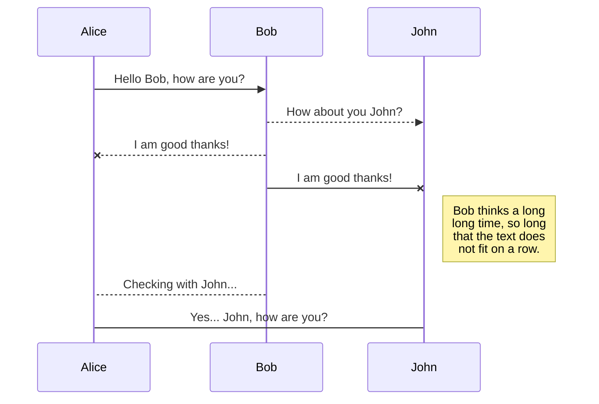
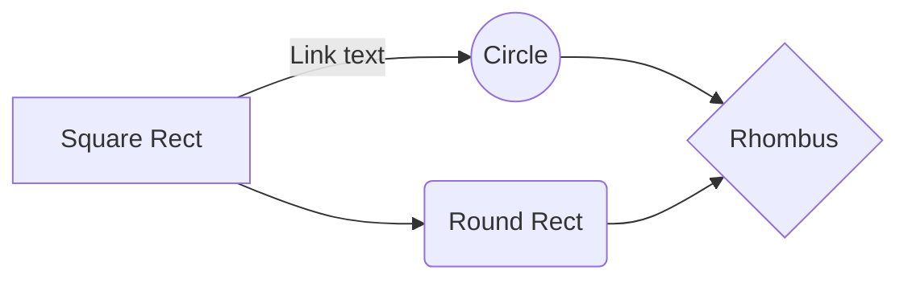

# Credit Card Fraud detection

Welcome to the Credit Card Fraud Detection System! This is a project aimed at detecting and preventing fraudulent transactions 
in financial institutions. The system uses statistical and machine learning techniques to analyze credit card transactions and 
identify potential fraudulent activities. It also incorporates a URL feature to improve its ability to detect new and emerging 
forms of fraud, such as phishing and phone fraud. The system is designed using the Domain-Driven Design (DDD) principles and 
has four main layers: Presentation, Application, Domain, and Infrastructure. Each layer has its own set of classes and 
interfaces that communicate with the other layers. The system aims to adhere in the future to banking security standards 
such as ISO 27001 and the Payment Card Industry Data Security Standard (PCI DSS) to ensure the security and privacy of 
user data. The system is scalable, maintainable, and deployable on cloud platforms such as render.com.

# Requirements

Requirements
- Python 3.7 or later
- [Flask](https://flask.palletsprojects.com/) 2.0 or later 
- [TensorFlow](https://www.tensorflow.org/) 2.6 or later 
- [scikit-learn](https://scikit-learn.org/) 1.0 or later 
- [requests](https://docs.python-requests.org/) 2.26 or later 

## Installation

1. Clone the repository: git clone https://github.com/Alekla0126/Credit-Card-Fraud-Detection
2. Install the required packages: pip install -r requirements.txt
3. Run the application: python app.py

## Local usage

1. Open a web browser and go to http://localhost:5000/.
2. Enter a URL or a credit card number and click the "Detect" button.
3. Wait for the prediction result to appear on the screen.

## Database

The system uses a database to store user data and credit card information. For this project, we have generated synthetic data using the Sparkov Data Generation tool developed by B. Harris [1]. In addition, we have used a publicly available dataset of phishing URLs from Kaggle, developed by A. Mahmoud [2], to train our prediction model.

The database is implemented using SQLite, a lightweight and easy-to-use relational database management system. The database schema is designed using Object Relational Mapping (ORM) principles to allow for easy integration with the Domain layer of the system.

The database schema includes tables for storing user information, credit card information, and predicted results. The user table includes fields for storing user ID, name, and email. The credit card table includes fields for storing credit card number, expiration date, and CVV. The predicted results table includes fields for storing the URL, prediction result, and timestamp.

Overall, the use of a database allows for efficient storage and retrieval of user data and predictions, making the system more scalable and maintainable.

References:

[1] Harris, B. "Sparkov Data Generation." GitHub, 03-May-2023. [Online]. Available: https://github.com/namebrandon/Sparkov_Data_Generation.

[2] Mahmoud, A. "Phishing URL Detection." Kaggle, 03-May-2023. [Online]. Available: https://www.kaggle.com/code/ahmedxmahmoud/phishing-url-detection/input.

## To do

All your files and folders are presented as a tree in the file explorer. You can switch from one to another by clicking a file in the tree.

## License

This project is licensed under the MIT License. See the LICENSE file for details.

## Delete a file

You can delete the current file by clicking the **Remove** button in the file explorer. The file will be moved into the **Trash** folder and automatically deleted after 7 days of inactivity.

## Export a file

You can export the current file by clicking **Export to disk** in the menu. You can choose to export the file as plain Markdown, as HTML using a Handlebars template or as a PDF.

# Synchronization

Synchronization is one of the biggest features of StackEdit. It enables you to synchronize any file in your workspace with other files stored in your **Google Drive**, your **Dropbox** and your **GitHub** accounts. This allows you to keep writing on other devices, collaborate with people you share the file with, integrate easily into your workflow... The synchronization mechanism takes place every minute in the background, downloading, merging, and uploading file modifications.

There are two types of synchronization and they can complement each other:

- The workspace synchronization will sync all your files, folders and settings automatically. This will allow you to fetch your workspace on any other device.
	> To start syncing your workspace, just sign in with Google in the menu.

- The file synchronization will keep one file of the workspace synced with one or multiple files in **Google Drive**, **Dropbox** or **GitHub**.
	> Before starting to sync files, you must link an account in the **Synchronize** sub-menu.

## Open a file

You can open a file from **Google Drive**, **Dropbox** or **GitHub** by opening the **Synchronize** sub-menu and clicking **Open from**. Once opened in the workspace, any modification in the file will be automatically synced.

## Save a file

You can save any file of the workspace to **Google Drive**, **Dropbox** or **GitHub** by opening the **Synchronize** sub-menu and clicking **Save on**. Even if a file in the workspace is already synced, you can save it to another location. StackEdit can sync one file with multiple locations and accounts.

## Synchronize a file

Once your file is linked to a synchronized location, StackEdit will periodically synchronize it by downloading/uploading any modification. A merge will be performed if necessary and conflicts will be resolved.

If you just have modified your file and you want to force syncing, click the **Synchronize now** button in the navigation bar.

> **Note:** The **Synchronize now** button is disabled if you have no file to synchronize.

## Manage file synchronization

Since one file can be synced with multiple locations, you can list and manage synchronized locations by clicking **File synchronization** in the **Synchronize** sub-menu. This allows you to list and remove synchronized locations that are linked to your file.

# Publication

Publishing in StackEdit makes it simple for you to publish online your files. Once you're happy with a file, you can publish it to different hosting platforms like **Blogger**, **Dropbox**, **Gist**, **GitHub**, **Google Drive**, **WordPress** and **Zendesk**. With [Handlebars templates](http://handlebarsjs.com/), you have full control over what you export.

> Before starting to publish, you must link an account in the **Publish** sub-menu.

## Publish a File

You can publish your file by opening the **Publish** sub-menu and by clicking **Publish to**. For some locations, you can choose between the following formats:

- Markdown: publish the Markdown text on a website that can interpret it (**GitHub** for instance),
- HTML: publish the file converted to HTML via a Handlebars template (on a blog for example).

## Update a publication

After publishing, StackEdit keeps your file linked to that publication which makes it easy for you to re-publish it. Once you have modified your file and you want to update your publication, click on the **Publish now** button in the navigation bar.

> **Note:** The **Publish now** button is disabled if your file has not been published yet.

## Manage file publication

Since one file can be published to multiple locations, you can list and manage publish locations by clicking **File publication** in the **Publish** sub-menu. This allows you to list and remove publication locations that are linked to your file.

# Markdown extensions

StackEdit extends the standard Markdown syntax by adding extra **Markdown extensions**, providing you with some nice features.

> **ProTip:** You can disable any **Markdown extension** in the **File properties** dialog.

## SmartyPants

SmartyPants converts ASCII punctuation characters into "smart" typographic punctuation HTML entities. For example:

|                |ASCII                          |HTML                         |
|----------------|-------------------------------|-----------------------------|
|Single backticks|`'Isn't this fun?'`            |'Isn't this fun?'            |
|Quotes          |`"Isn't this fun?"`            |"Isn't this fun?"            |
|Dashes          |`-- is en-dash, --- is em-dash`|-- is en-dash, --- is em-dash|

## KaTeX

You can render LaTeX mathematical expressions using [KaTeX](https://khan.github.io/KaTeX/):

The *Gamma function* satisfying $\Gamma(n) = (n-1)!\quad\forall n\in\mathbb N$ is via the Euler integral

$$
\Gamma(z) = \int_0^\infty t^{z-1}e^{-t}dt\,.
$$

> You can find more information about **LaTeX** mathematical expressions [here](http://meta.math.stackexchange.com/questions/5020/mathjax-basic-tutorial-and-quick-reference).

## UML diagrams

You can render UML diagrams using [Mermaid](https://mermaidjs.github.io/). For example, this will produce a sequence diagram:

And this will produce a flow chart:

