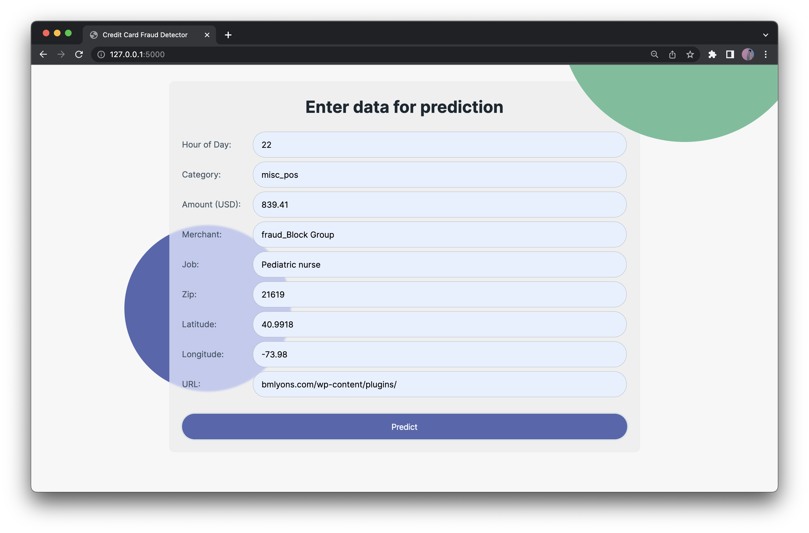
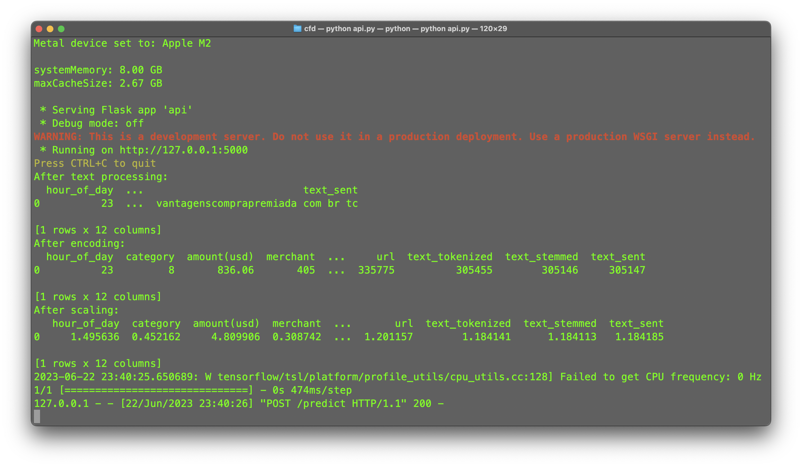
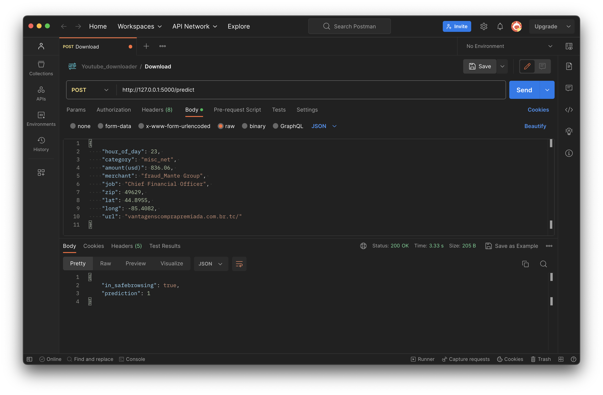

# Card Fraud Detection

Welcome to the Credit Card Fraud Detection System! This is a project aimed at detecting and preventing fraudulent transactions 
in financial institutions. The system uses statistical and machine learning techniques to analyze credit card transactions and 
identify potential fraudulent activities. It also incorporates a URL feature to improve its ability to detect new and emerging 
forms of fraud, such as phishing and phone fraud. The system is designed using the Domain-Driven Design (DDD) principles and 
has four main layers: Presentation, Application, Domain, and Infrastructure. The system aims to adhere in the future to banking security standards such as ISO 27001 and the Payment Card Industry Data Security Standard (PCI DSS) to ensure the security and privacy of user data. The system is scalable, maintainable, and deployable on cloud platforms such as Google Cloud.

# Requirements

Requirements
- [Python](https://www.python.org/downloads/release/python-370/) Python 3.7 or later
- [Flask](https://flask.palletsprojects.com/) 2.0 or later 
- [TensorFlow](https://www.tensorflow.org/) 2.6 or later 
- [scikit-learn](https://scikit-learn.org/) 1.0 or later 
- [requests](https://docs.python-requests.org/) 2.26 or later 

## Installation

1. Clone the repository: git clone https://github.com/Alekla0126/Card-Fraud-Detection
2. Install the required packages: pip install -r requirements.txt
3. Run the application: 
- $ cd /cfd 
- $ python app.py

## Local usage

1. Open a web browser and go to http://localhost:5000/.
2. Enter a URL or a credit card number and click the "Detect" button.
3. Wait for the prediction result to appear on the screen.

## Dataset

The system does not store any user data or credit card information. For this project, synthetic data was generated using the Sparkov Data Generation tool developed by B. Harris [1]. The tool helps generate artificial data that resembles real data without containing any real user information or credit card details. Additionally, a publicly available dataset of phishing URLs from Kaggle, developed by A. Mahmoud [2], was used to train the prediction model.

The database schema includes JSON for temporary storage during runtime but does not persistently store any user information, credit card information, or the generated synthetic data. It primarily consists of a predicted results table with fields for storing the URL, prediction result, and timestamp. This table serves the purpose of capturing the results of the prediction model for analysis and monitoring.

References:

[1] Harris, B. "Sparkov Data Generation." GitHub, 03-May-2023. [Online]. Available: https://github.com/namebrandon/Sparkov_Data_Generation.

[2] Mahmoud, A. "Phishing URL Detection." Kaggle, 03-May-2023. [Online]. Available: https://www.kaggle.com/code/ahmedxmahmoud/phishing-url-detection/input.

## DDD

## App deployment

## To do

- [x] Deploy
- [x] Test with synthetic data.
- [ ] Test with real data.
- [ ] Try with real data.
- [ ] Add a captcha.

## License

This project is licensed under the MIT License. See the LICENSE file for details.

